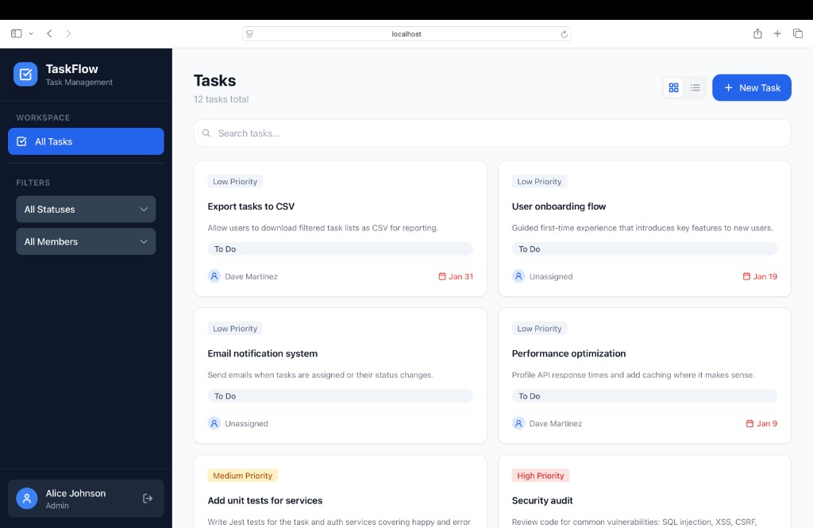
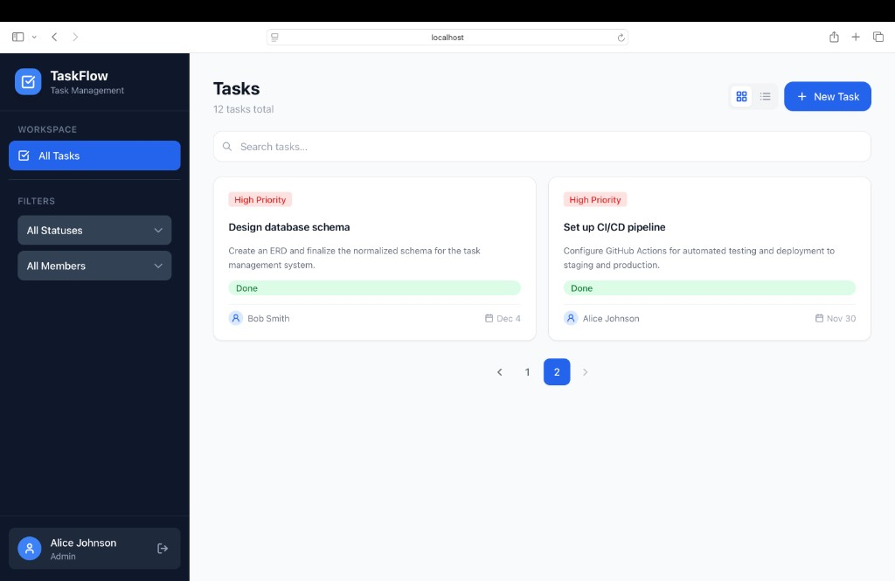
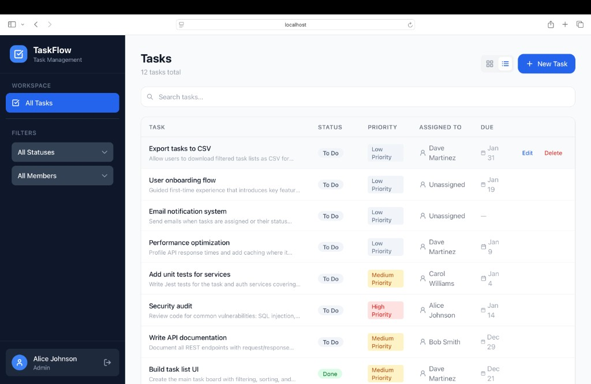
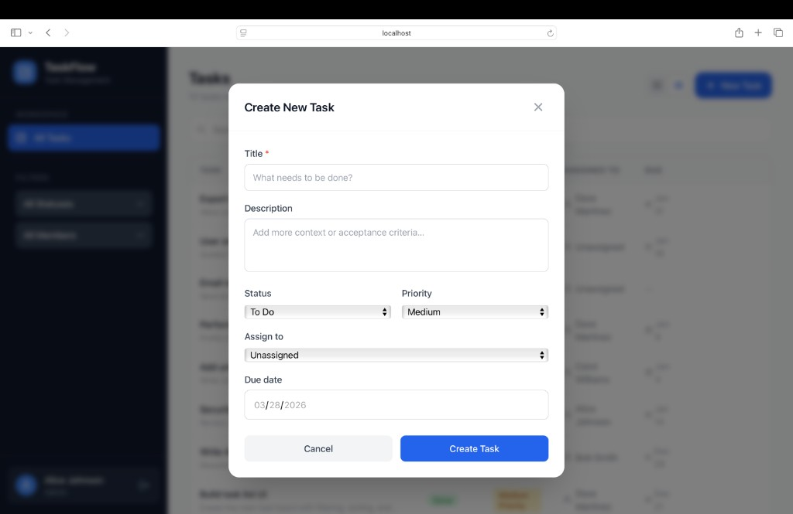

# TaskFlow — Task Management System

A full-stack task management app built for the Microchip Technology engineering exercise. The idea was to build something a real team could actually use — proper architecture, role-based permissions, and a UI that stays out of the way.

---

## Screenshots

**Task Dashboard — Grid View**



**Pagination**



**Task Dashboard — List View**



**Create New Task**



---

## Stack

| Layer      | Technology                                                              |
|------------|-------------------------------------------------------------------------|
| Frontend   | React 18, TypeScript, Vite, Tailwind CSS, TanStack Query, React Hook Form |
| Backend    | Node.js, Express, TypeScript                                            |
| Database   | SQLite via Prisma ORM (one line to switch to PostgreSQL)                |
| Auth       | JWT tokens, bcrypt-hashed passwords                                     |

---

## Project Structure

```
Task Management System/
│
├── backend/
│   ├── prisma/
│   │   ├── schema.prisma       # Tables, columns, indexes, relationships
│   │   └── seed.ts             # Loads sample users and tasks on first run
│   │
│   └── src/
│       ├── controllers/        # Reads the request, calls the service, sends the response
│       ├── services/           # Business logic — no HTTP knowledge, easy to test
│       ├── routes/             # URL definitions and input validation rules
│       ├── middleware/         # JWT auth guard and central error handler
│       ├── lib/                # Prisma client (singleton)
│       └── types/              # Shared TypeScript types
│
├── frontend/
│   └── src/
│       ├── api/                # Axios wrappers — one file per resource
│       ├── components/         # Reusable UI pieces
│       ├── contexts/           # AuthContext — login state + localStorage sync
│       ├── hooks/              # React Query hooks for data fetching
│       ├── pages/              # LoginPage and TasksPage
│       └── types/              # Shared TypeScript types
│
├── README.md
└── API.md                      # Full endpoint reference with examples
```

---

## Getting Started

**Requirements:** Node.js 18+, npm 9+

### 1. Install dependencies

```bash
cd backend && npm install
cd frontend && npm install
```

### 2. Environment variables

The backend ships with a `.env` file ready for local development. No changes needed to get started.

```bash
# To customise:
cp backend/.env.example backend/.env
```

### 3. Set up the database

```bash
cd backend
npm run db:migrate   # creates the SQLite file and applies the schema
npm run db:seed      # loads 4 sample users and 12 tasks
```

### 4. Start both servers

```bash
# Terminal 1 — backend on port 3001
cd backend && npm run dev

# Terminal 2 — frontend on port 5173
cd frontend && npm run dev
```

Open **http://localhost:5173**.

---

## Test Accounts

All accounts use the password `password123`. The login page has quick-fill buttons so you don't need to type.

| Name           | Email                | Role   |
|----------------|----------------------|--------|
| Alice Johnson  | alice@example.com    | Admin  |
| Bob Smith      | bob@example.com      | Member |
| Carol Williams | carol@example.com    | Member |
| Dave Martinez  | dave@example.com     | Member |

---

## Features

### Login
- Form validation — empty fields and invalid emails are caught before the request is sent
- Wrong email or password shows an inline error message directly on the form (same style as field errors)
- Show/hide password toggle
- Session survives browser restarts (token stored in localStorage)
- Any page visited without a valid session redirects to `/login`

### Task Dashboard
- Grid or table view — toggle with one click
- Search tasks by title or description (live, no submit needed)
- Filter by status: To Do, In Progress, Done
- Filter by assigned team member
- Pagination — 10 tasks per page, smart page number list
- Task count updates as filters change

### Task Cards
Each card shows title, description, status, priority, assignee, and due date. Due dates past today turn red if the task isn't done. Edit and delete buttons appear on hover — grayed out if you don't have permission.

### Creating and Editing Tasks
- Modal form with validation (title required, dates must be a real date)
- All fields optional except title
- Edit form pre-fills the existing values
- Button shows a spinner while saving
- Toast notification on success or error

### Deleting Tasks
- Confirmation dialog before anything is removed
- Soft delete — `deletedAt` is set on the record, not wiped from the database
- Deleted tasks can be recovered directly from the database if needed

### Role-Based Access

| Action      | Admin | Creator | Assignee | Other member |
|-------------|-------|---------|----------|--------------|
| Create task | Yes   | —       | —        | Yes          |
| Assign task | Any   | Any     | Any      | Any          |
| Edit task   | Yes   | Yes     | Yes      | No           |
| Delete task | Yes   | No      | No       | No           |

Anyone can create a task and assign it to any team member. Creators and assignees can edit their tasks. Only admins can delete tasks.

Edit and delete buttons are visible to everyone. Buttons that a user doesn't have permission to use are grayed out and disabled, with a tooltip explaining why. The same rules are enforced on the backend — the API returns 403 if a member tries to act on a task they don't own.

### Responsive Design
- Sidebar on desktop (768px and wider)
- Hamburger menu on mobile — slides in from the left, closes on outside tap
- Task grid collapses to one column on small screens

---

## Backend Architecture

```
Request
  -> Route         validates input fields
  -> Middleware    checks the JWT, attaches the user to the request
  -> Controller    pulls data from the request, calls the right service
  -> Service       business logic (role checks, data rules, DB queries)
  -> Response
```

Business logic lives only in the service layer, which has no knowledge of HTTP. Easy to unit test and reuse. All errors bubble up through a single handler so every API error has the same JSON shape.

---

## Database Design

### Users

| Column    | Notes                                      |
|-----------|--------------------------------------------|
| id        | CUID — generated automatically             |
| email     | Unique, indexed                            |
| name      |                                            |
| password  | bcrypt hash                                |
| role      | ADMIN or MEMBER                            |
| deletedAt | null means active; a timestamp means deleted |

### Tasks

| Column       | Notes                                      |
|--------------|--------------------------------------------|
| id           | CUID                                       |
| title        | Required, 200 char max                     |
| description  | Optional                                   |
| status       | TODO, IN_PROGRESS, or DONE                 |
| priority     | LOW, MEDIUM, or HIGH                       |
| dueDate      | Optional                                   |
| createdById  | References the User who created it         |
| assignedToId | References the assigned User, nullable     |
| deletedAt    | Soft delete                                |

Indexes on `status`, `assignedToId`, `deletedAt`, and `createdAt` — the columns that show up most in filters and sorts.

---

## Scripts

### Backend

| Command              | Description                                  |
|----------------------|----------------------------------------------|
| `npm run dev`        | Start with hot-reload                        |
| `npm run build`      | Compile TypeScript to `dist/`                |
| `npm run start`      | Run the compiled build                       |
| `npm run db:migrate` | Apply schema changes                         |
| `npm run db:seed`    | Insert sample data                           |
| `npm run db:studio`  | Open Prisma Studio — visual database browser |
| `npm run db:reset`   | Wipe and re-seed from scratch                |

### Frontend

| Command           | Description                        |
|-------------------|------------------------------------|
| `npm run dev`     | Start Vite dev server              |
| `npm run build`   | Type-check and build for production |
| `npm run preview` | Preview the production build       |

---

## Troubleshooting

**Port 3001 already in use:**
```bash
lsof -ti:3001 | xargs kill -9
```

**Login not working:**
```bash
cd backend && npm run db:seed
```

**Start fresh:**
```bash
cd backend && npm run db:reset
```

---

## What I Would Add Before Production

Out of scope for this exercise, but worth noting:

- PostgreSQL in place of SQLite — one line in `schema.prisma`
- Rate limiting on the login endpoint
- Refresh token rotation
- HttpOnly cookies instead of localStorage for token storage
- Unit tests for each service function using Jest
- Docker Compose for a one-command local setup
- Structured JSON logging with Pino

---

## API Reference

See [API.md](./API.md) for the full endpoint reference with request and response examples.
